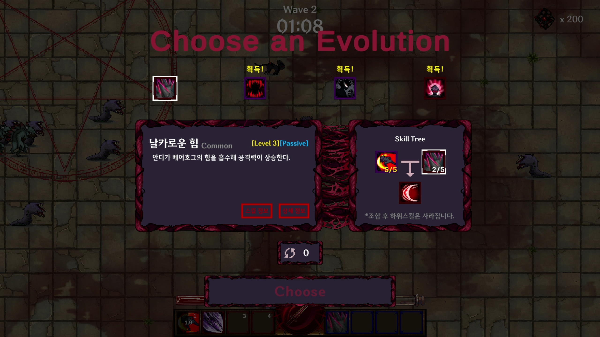
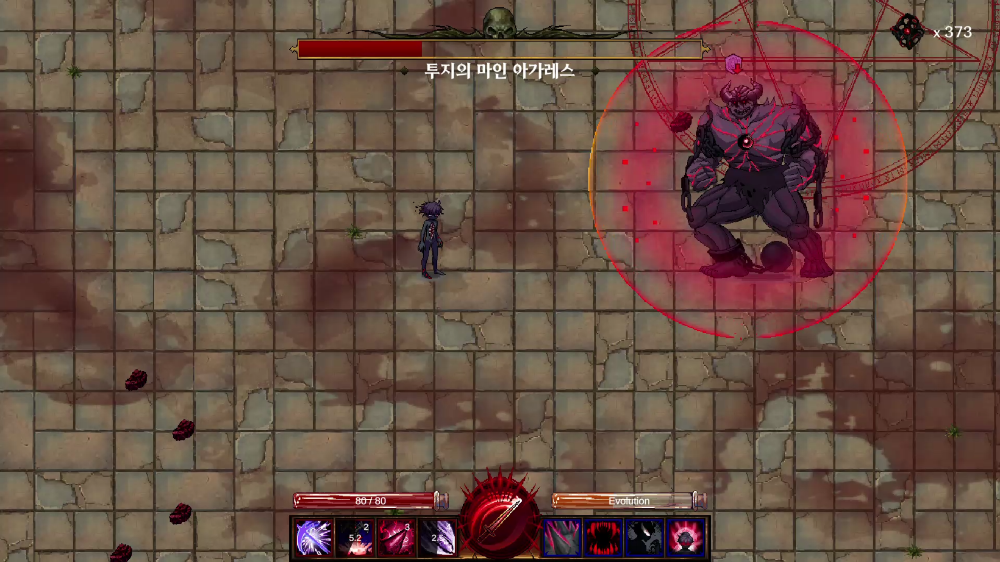

# 소개

**Eater_Demon-of-Gluttony** 는 서울시립대학교 중앙동아리 Level Up 게임 개발부에서 진행한 프로젝트로서 "뱀파이어 서바이버즈 (Vampire Survivors)"로부터 영감을 받아 제작한 로그라이크 액션 게임입니다. 잔혹한 악마 바알의 '포식'능력을 얻은 당신은, 적의 능력을 흡수하고 다양한 스킬을 조합해 싸울 수 있습니다. 피에 굶주린 괴물로 변해버린 실험체 무리를 상대로 살아남을 수 있을까요?

## 조작방법

- 이동 : W, A, S, D

- 공격 및 UI 상호작용 : 마우스 좌클릭 (LM)
*기본 공격은 플레이어가 바라보는 방향이 아닌 마우스 커서 방향으로 공격합니다.

- 대쉬 : Spacebar

- 상호작용 : F

- 옵션 및 일시정지 : ESC

- 스킬 : 숫자키 1, 2, 3, 4

## 다운로드 링크
- https://store.onstove.com/ko/games/101375

## 상세설명

- 뱀서라이크와 ARPG의 만남!

사방에서 몰려오는 적들을 정신없이 해치우는 뱀서라이크 장르와 다양한 스킬을 활용해 스타일리쉬한 전투가 가능한 ARPG 장르가 합쳐져 독특한 게임플레이를 경험할 수 있습니다.

- 포만감 시스템

폭식의 악마 **'바알'** 의 능력을 받아들인 대신에, 당신은 걷잡을 수 없는 허기를 느끼게 되었습니다. 웨이브가 진행될수록 기하급수적으로 감소하는 포만감을 몬스터를 쉴 새 없이 집어삼켜 해결하세요!

- 스킬 획득 및 조합 시스템

당신은 **'바알'** 의 고유 능력과 더불어, 몬스터로부터 능력을 흡수하여 새로운 스킬을 얻을 수 있습니다. 또한, 이렇게 얻은 스킬들은 강화와 합성을 거쳐 또 다른 유니크한 스킬로 거듭나게 됩니다. 당신의 플레이스타일에 맞는 다양한 스킬 조합을 시험해보세요!

- 보스전

웨이브의 막바지에는 당신을 시험할 강력한 보스가 기다리고 있습니다. 웨이브 진행 중 획득하고 강화한 당신만의 스킬들로 보스를 무찌르세요. 보스를 무찌르는데 성공하면 새로운 플레이스타일을 시도할 수 있는 능력인 해방 스킬이 해금됩니다.

## 이미지

## 개발 참여 인원

개발 참여 인원 | 이메일 | 개발 내용   

[개발]

1. 서장원 : seojangwon46@gmail.com
- 스킬, 몬스터 AI 개발 및 NPC 대화 시스템, 튜토리얼, SoundEffect 및 Music 시스템, 각종 UI 기능 구현 등 전반적인 게임의 기능 구현
2. 이치훈 : chlee0350@gmail.com
- 몬스터 생성, 스테이지 매니저, UI, 게임 설정 기능 구현
3. 이석원 : suck758@naver.com
- 퀘스트, 업적 시스템, 세이브/로드 시스템, UI, NPC 상호작용 등의 기능 구현, git 담당
  
[기획]

1. 한의재 : hej496849@gmail.com
- 전투 디자인 및 밸런스, 몬스터 AI, 스킬 이펙트 및 모션, 인게임 재화, 일부 사운드 이펙트, 일부 UI 등 시스템 기획
2. 오승연 : minchan02234@gmail.com
- 튜토리얼 기획, BGM 및 SFX 기획/일부 제작(audio city 사용), NPC 및 튜토리얼 대사 기획, 전체 몬스터 외형 설정

[아트]

1. 박유빈 : dq0505@naver.com
- 게임 로고 디자인, NPC 캐릭터 도트 그래픽 디자인 및 애니메이션 제작 (바알,카를), 몬스터 도트 그래픽 디자인(코첼라,카리스) 및 애니메이션 제작, 주인공 캐릭터 스킬 애니메이션 제작 (안디), 게임 내 UI 디자인 (도감 및 스킬 선택지 창, 스킬 아이콘, 아이템 등), 스킬 이펙트 애니메이션 제작
2. 조성은 : secho1018@gmail.com
- 게임 배경 디자인, 게임 메인 화면 디자인, 몬스터 베어호그 도트 그래픽 디자인 및 애니메이션 제작, 게임 내 Ul 디자인 (마우스 커서, 스텟 강화 창, 해방 스킬 강화 창 등), 스킬 이펙트 애니메이션 제작
3. 박소연 : soso_0317@naver.com
- 주인공 캐릭터 스킬 애니메이션 제작 (안디), 스킬 이펙트 애니메이션 제작 
4. 전하연 : msam113@naver.com
- 몬스터 도트 그래픽 디자인 및 애니메이션 제작 (리퍼,보스 몬스터)
5. 최은서 : tmen0316@gmail.com
- 주인공 캐릭터(변신 전, 후) 도트 그래픽 디자인 및 idle, run 애니메이션 제작, 주인공 캐릭터 악마의검술 스킬 애니메이션 제작

[추가적인 도움을 주신 분들]
1. 김수현 : susancat@gmail.com
- 주인공 캐릭터 투지스킬 애니메이션 제작
2. 전소윤 : jsy8790@gmail.com
- 맵 타일 일부 도트 제작 및 자료실, 실험실 디자인 및 일부 가구 디자인
